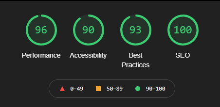

# DayPlanner
*Daily Scheduler utilizing JavaScript, Day.js, loops and localStorage*

[View Deployed Application Here.](https://pythonidaer.github.io/DayPlanner/)

## Installation
1. Clone repository to your local device
2. Test by opening the index.html file in your browser. If it looks good, it's working right.
3. If it does not work, right-click Inspect console to determine if there is an issue with the directories.

## Usage
This repo is simply a homework assignment. Feel free to inspect the code and notice how I made a Daily Scheduler application:
- Incorporating Day.js and using the hour feature to compare against a simple data attribute integer
- Using arrays to loop over time blocks to display the hour dynamically
- Creating an entire Day Planner with less than 10 html elements in the `<body>`
- Clearing localStorage, an array, and textarea.value with the click of a button
- Adding a dynamic eventListener that will assign textarea array to another array and set to localStorage
  
## Credits
[WAI Form Instructions](https://www.w3.org/WAI/tutorials/forms/instructions/) 

[How do I align a Label and a Textarea](https://stackoverflow.com/questions/1839403/how-do-i-align-a-label-and-a-textarea) 

[Query Selector All](https://developer.mozilla.org/en-US/docs/Web/API/Document/querySelectorAll) 

[forEach](https://www.freecodecamp.org/news/javascript-foreach-how-to-loop-through-an-array-in-js/) 

[Day.js documentation](https://day.js.org/en/) 

[Get Strings in Day.js](https://day.js.org/docs/en/get-set/get) 

[forEach() MDN documentation](https://developer.mozilla.org/en-US/docs/Web/JavaScript/Reference/Global_Objects/Array/forEach) 

[How To Traverse the DOM](https://www.digitalocean.com/community/tutorials/how-to-traverse-the-dom) 

[How to add accessible names to buttons](https://web.dev/button-name/?utm_source=lighthouse&utm_medium=devtools) 

[Form elements do not have associated labels](https://web.dev/label/?utm_source=lighthouse&utm_medium=devtools) 

[Background and foreground colors do not have a sufficient contrast ratio](https://web.dev/color-contrast/?utm_source=lighthouse&utm_medium=devtools) 

[DOMContentLoaded](https://developer.mozilla.org/en-US/docs/Web/API/Window/DOMContentLoaded_event) 

[How To Use an Attribute Selector for CONTAINS in querySelectorAll()](https://stackoverflow.com/questions/31773599/can-i-use-an-attribute-selector-for-contains-in-queryselector) 

[Web Content Accessibility Guidelines](https://www.w3.org/TR/WCAG21/#contrast-minimum) 

[Web AIM Contrast Checker](https://webaim.org/resources/contrastchecker/) 

[Working with Dates and Times in JS (moment, date-fns, luxon)](https://www.youtube.com/watch?v=U4GJA7pY0O0&t=2s) 

[How to Format Dates in JavaScript with day.js](https://www.youtube.com/watch?v=vzGzys3enCE&t=1s) 

[get and set data attributes](https://blog.wplauncher.com/get-and-set-data-attributes-with-javascript/) 

[Adding eventListeners to Multiple Elements](https://stackoverflow.com/questions/40956717/how-to-addeventlistener-to-multiple-elements-in-a-single-line) 

[CSS Borders](https://www.w3schools.com/css/css3_borders.asp) 

[How to Modify the Placeholder](https://www.w3schools.com/howto/howto_css_placeholder.asp) 

[Font Awesome (save icon)](https://fontawesome.com/icons/save?style=regular) 

[Setting multiple attributes for an element at once with JavaScript](https://stackoverflow.com/questions/12274748/setting-multiple-attributes-for-an-element-at-once-with-javascript) 

[Element.classList](https://developer.mozilla.org/en-US/docs/Web/API/Element/classList) 

[Pseudocode Examples](https://www.unf.edu/~broggio/cop2221/2221pseu.htm) 

## Future Improvements
In class, Scott (our instructor) showed us how to create a text-less HTML template in the HTML file, then .clone() it with jQuery. Ultimately, I think my DayPlanner doesn't ace Lighthouse accessibility rankings because it doesn't read the textarea within the label until after it's rendered onto the page. There are still some JavaScript alternatives (ahem - hacks) I could try, such as adding textContent to the label, along with a class that hides the label, but I think reviewing .clone() in the future will be a better, more practical approach.

I would also like to make this assignment less ugly. This product is meant to display JavaScript, not be displayed in an art gallery. One immediate change I can think of is to remove the 'Clear All' button, and to add a delete/trash icon beside each save/floppy disk icon in the right side of the planner.  The main functionality difference there would be the button needing to target a specific array item within the localStorage object, as opposed to the entire array.

Lastly, I had initially planned to refactor this in the CSS Framework Bulma. However, since we are focusing so much on jQuery and already rushing into APIs, I want to focus on refactoring this code into jQuery so that learning APIs is easier in class. Once I finish converting this vanilla js to jQuery, I will delete this note.
  
## License
I've chosen an MIT License. Do what you'd like with this material.

#### The Website

## Contact:
You can email me at codefolio.work@gmail.com
